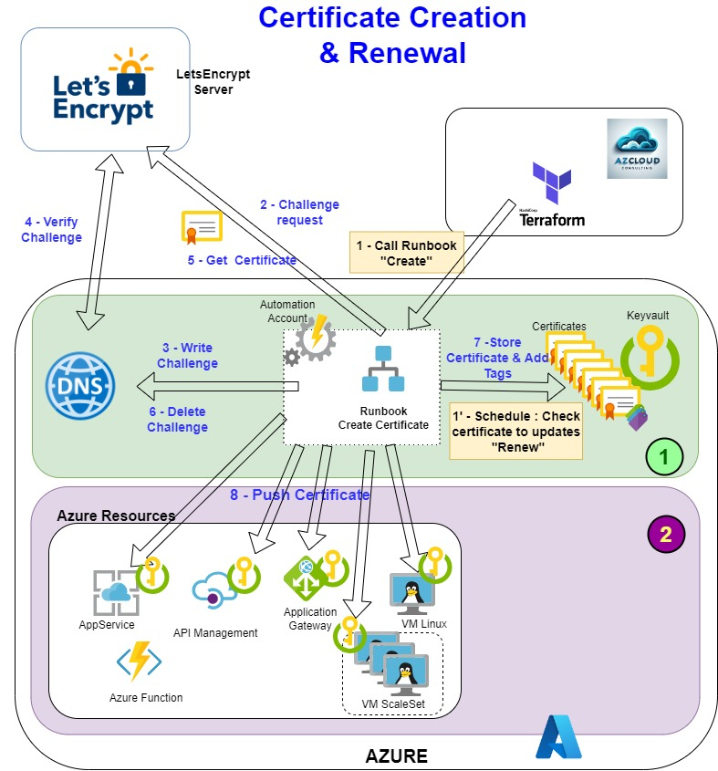

[comment]: <> (
  Le code entre les balise '<!--' et '-->' est à conserver :
  Il permet de créer une table des matières lors de la génération du docx via le script gendoc.sh
)

<!--
```{=openxml}
<w:p>
  <w:r>
    <w:br w:type="page"/>
  </w:r>
</w:p>
<w:sdt>
  <w:sdtPr>
    <w:docPartObj>
      <w:docPartGallery w:val="Sommaire" /><w:docPartUnique />
    </w:docPartObj>
  </w:sdtPr>
  <w:sdtContent>
    <w:p>
      <w:pPr><w:pStyle w:val="En-ttedetabledesmatires" /></w:pPr>
      <w:r><w:t>Table des matières</w:t></w:r>
    </w:p>
    <w:p></w:p>
    <w:p>
      <w:r>
        <w:fldChar w:fldCharType="begin" w:dirty="true" />
        <w:instrText> TOC \o "1-3" \h \z \u</w:instrText><w:fldChar w:fldCharType="separate" />
        <w:fldChar w:fldCharType="end" />
      </w:r>
    </w:p>
  </w:sdtContent>
</w:sdt>
```
-->

# Gestion des certificats LetEncrypt dans Azure

## Sommaire
- [Gestion des certificats LetEncrypt dans Azure](#gestion-des-certificats-letencrypt-dans-azure)
  - [Sommaire](#sommaire)
- [1. Introduction](#1-introduction)
  - [1.1. Référence documentaire](#11-référence-documentaire)
  - [1.2. Objet](#12-objet)
- [2. Architecture et principes](#2-architecture-et-principes)
- [3. Description des Ressources créées](#3-description-des-ressources-créées)
- [4. L'Automation Account et le Storage Account](#4-lautomation-account-et-le-storage-account)
  - [4.1. L'Automation Account](#41-lautomation-account)
  - [4.2. Le Storage Account](#42-le-storage-account)
- [5. Le Keyvault](#5-le-keyvault)
  - [5.1. Nommage des certificats](#51-nommage-des-certificats)
  - [5.2. Les Tags](#52-les-tags)
- [6. Les Runbooks](#6-les-runbooks)
  - [6.1. Runbook Create-LetsEncrypt](#61-runbook-create-letsencrypt)
    - [6.1.1. Les Paramètres](#611-les-paramètres)
    - [6.1.2. L'appel via Terraform](#612-lappel-via-terraform)
  - [6.2. Runbook Renew-LetsEncrypt](#62-runbook-renew-letsencrypt)
    - [6.2.1. Les Paramètres](#621-les-paramètres)
- [7. Installation des certificats dans les Ressources](#7-installation-des-certificats-dans-les-ressources)
- [8. Les POC (Mini Projet)](#8-les-poc-mini-projet)
  - [8.1. POC AppService](#81-poc-appservice)
  - [8.2. POC VMLinux](#82-poc-vmlinux)
- [9. Liens vers le code](#9-liens-vers-le-code)
  

# 1. Introduction

## 1.1. Référence documentaire

| Ref.                                  | Description    |
| :-----------------------              | :----------------------- |
| [ACME-PS](https://github.com/PKISharp/ACME-PS/tree/master)   | PowerShell module supporting LetsEncrypt ACME v2. |


## 1.2. Objet

Ce document présente un système de gestions automatisées des certificats letsencrypt  : création, renouvellement.  
C'est la première partie du système global qui intègre également une fonctionnalité d'installation automatique des certificats dans les ressources Azure. Cette seconde partie du système est décrite dans un autre document.

# 2. Architecture et principes 
La première partie du système est sur fond vert dans le schéma ci-dessous :
 

# 3. Description des Ressources créées

| Type de ressources | Nom    | Description | 
| :------------------| :----------------------- | :----------------------- |
| Resource Group     | \<TRI>-\<ENV>-RG-CERT   | Groupe de ressources du projet
| Automation Account | \<TRI>-\<ENV>-CERT-AAA  | Cette ressource héberge les Runbooks et permet créer des exécutions récurrentes |
| Key vault          | \<TRI>-\<ENV>-CERT-KVT  | Assure le stokage  des certificats |
| Storage Account    | \<tri>\<env>certsa  | Permet de stocker et de réutiliser le "state" LetsEncrypt |
| Runbook            | CreateCert-LetsEncrypt  | Code PowerShell permettant la création, le stockage et l'installation du certificat LetsEncrypt.<br>Mode de lancement : Exécuté par le Terraform de création des ressources (AppService, VM, etc ...)
| Runbook            | Renew-LetsEncrypt  | Code PowerShell gérant le renouvellement des certificats + Ré-installation.<br>Mode de lancement : Schedule dans l'Automation Account |  


# 4. L'Automation Account et le Storage Account

## 4.1. L'Automation Account
L'automation account va permettre d'automatiser les traitements grâce à l'hébergement et l'exécution programmée de Runbook contenant du code PowerShell.  

## 4.2. Le Storage Account
Le Storage Account va permettre de stocker les "state" des précédentes requêtes LetsEncrypt.

# 5. Le Keyvault
Le keyvault sert à stoker les certificats letsencrypt. A chaque certificats, des tags sont créés permettant de connaitre les ressources associées à ce certificat.

## 5.1. Nommage des certificats
Le nom des certificats dans le keyvault se base sur le nom du domaine, avec remplacement des points par des tirets.

## 5.2. Les Tags
Ci-dessous le tableau répertoriant les tags et leur presence par type de ressource :
| Tag            | Description    | AppService | API Mngt | App Gateway | VM/VMSS |
| :------------------| :----------------------- | :----| :----| :----| :----|
| dns_subscription | Souscription de la zone DNS |<center>X |<center>X |<center>X |<center>X |
| dns_zone | Nom de la zone DNS (ex app.azcloud-consulting.com) |<center>X |<center>X |<center>X |<center>X |
| subscription | Souscription des ressources concernées par le certificat |<center>X |<center>X |<center>X |<center>X |
| resource_group | Resource-group des ressources concernées par le certificat |<center>X |<center>X |<center>X |<center>X |
| resource_type | Type de ressource (AppService, API, AGW, VM, VMSS) |<center>AppService |<center>API |<center>AGW |<center>VM,VMSS |
| resources | Liste des ressources concernées par le certificat (ex : vm01,vm02) |<center>X |<center>X |<center>X |<center>X |
| endpoint_listener | Endpoint (API) : Nom du Enpoint sur lequel sera attaché le certificat (Proxy,Portal).<br>Listener (AGW) : Nom du listerner sur lequel sera attaché le certificat | |<center>X |<center>X | |
| keyvault | Keyvault associé aux ressources concernées par le certificat |<center>X |<center>X |<center>X |<center>X |


# 6. Les Runbooks
Les Runbook peuvent être codés en PowerShell ou Python, ils permettent d’exécuter des actions sur les ressources Azure.  
Nous avons choisi de les coder en PowerShell.

## 6.1. Runbook Create-LetsEncrypt
Ce Runbook permet de créer un certificat LetsEncrypt et le stocke dans le keyvault centralisé.  

Il fait également appel à un autre Runbook pour l'installation du certificat dans les ressources Azure (voir [§7](#7-installation-des-certificats-dans-les-ressources)).

### 6.1.1. Les Paramètres
| Position | Paramètre    | Description    | AppService | API Mngt | App Gateway | VM/VMSS |
| :--------| :---------- | :---------- | :----| :----| :----| :----|
| 1 | DomainNames | Nom du ou des domaines pour lesquels il faut créer le certificat.<br>Dans le cas d'une liste, le premier sera le domaine principal, les suivants seront des entrées SAN.<br>ex : "rec.azcloud-consulting.com,uat.azcloud-consulting.com" | <center>X |<center>X |<center>X |<center>X |
| 2 | DNSSubscriptionName  |  | <center>X |<center>X |<center>X |<center>X |
| 3 | DNSResourceGroup  |  | <center>X |<center>X |<center>X |<center>X |
| 4 | DNSzone  |  | <center>X |<center>X |<center>X |<center>X |
| 5 | SubscriptionName  |  | <center>X |<center>X |<center>X |<center>X |
| 6 | ResourceGroup  |  | <center>X |<center>X |<center>X |<center>X |
| 7 | ResourceType  |  | <center>AppService |<center>API |<center>AGW |<center>VM ou VMSS |
| 8 | Resources  |  | <center>X |<center>X |<center>X |<center>X |
| 9 | EndPoint_Listener  |  |  |<center>X<br>EndPoint : "Portal" ou "Proxy" |<center>X<br>NomListener | |
| 10 | KeyVault  |  | <center>(X) |<center>X<br>NomKeyvault/NomCertif |<center>X |<center>(X) |


(X) : Paramètre optionnel :
- AppServices : Keyvault nécessaire pour les AppServices dans un ASE (App Service Environment)
- VM : Keyvault facultatif, il sera créé par le Runbook

### 6.1.2. L'appel via Terraform
L'appel du Runbook Create-LetsEncrypt se fait par l'intermédiaire d'un **WebHook**.
La création du WebHook ainsi que son appel ont été codé dans un module terraform :
https://github.com/ppaven/prj-certif-modules-create-certif
 
## 6.2. Runbook Renew-LetsEncrypt
Ce Runbook permet de renouveler les certificats LetsEncrypt.

Il fait également appel à un autre Runbook pour l'installation du certificat dans les ressources Azure (voir [§7](#7-installation-des-certificats-dans-les-ressources)).

### 6.2.1. Les Paramètres
| Paramètre    | Description    |
| :---------- | :---------- |
| CertNameInVault | Si \<vide> : Le Runbook va vérifier la date de validité des certificats dans le keyvault et regénère puis installe le certificat si sa date de validité est inférieure à 40 jours. <br>Si \<non-vide> : Le Runbook force la regénération du certificat puis l'installe |
| OnlyCheck (True/False) | Si True : Affiche seulement la liste des certificats à renouveler (sans les renouveler).<br>False par default |

# 7. Installation des certificats dans les Ressources 
Consulter : [Upload des certificats](https://github.com/ppaven/prj-certif-doc/blob/master/Certificates-MUpload.md)

# 8. Les POC (Mini Projet)

Pour tester les différents modules de gestions des certificats dans Azure, il a été créé des mini projets (POC) dont la structure des répertoires est la suivante : 
```
.
├── doc
│         
├── modules
│   ├── certif-mgmt-infra
│   │   ├── README.md
│   │   ├── automation_account.tf
│   │   ├── keyvault.tf
│   │   ├── main.tf
│   │   ├── runbooks
│   │   │   ├── CreateCert-LetsEncrypt.tpl.ps1
│   │   │   └── Renew-LetsEncrypt.tpl.ps1
│   │   ├── runbooks.tf
│   │   ├── sa.tf
│   │   └── vars.tf
│   ├── create-certif
│   │   ├── README.md
│   │   ├── create_certif.tf
│   │   ├── main.tf
│   │   ├── outputs.tf
│   │   └── vars.tf
│   ├── tags
│   │   ├── README.md
│   │   ├── outputs.tf
│   │   └── vars.tf
│   ├── upload-certif
│   │   ├── README.md
│   │   ├── main.tf
│   │   ├── upload_certif.tf
│   │   └── vars.tf
│   └── uploadcert-infra
│       ├── README.md
│       ├── automation_account.tf
│       ├── keyvault.tf
│       ├── main.tf
│       ├── runbooks
│       │   └── UploadCertToResources.tpl.ps1
│       ├── runbooks.tf
│       ├── scripts
│       │   └── update_cert.sh
│       └── vars.tf
├── poc
    ├── 1-appservice
    │   ├── README.md
    │   ├── app_service.tf
    │   ├── app_service_plan.tf
    │   ├── cert_infra.tf
    │   ├── create_certif_appservice.tf
    │   ├── dns.tf
    │   ├── main.tf
    │   ├── scripts
    │   │   └── export_ovh_dns.py
    │   ├── tags.tf
    │   ├── terraform.tf
    │   ├── terraform.tfvars
    │   ├── uploadcert_infra.tf
    │   └── vars.tf
    └── 2-vmlinux
        ├── README.md
        ├── avm_kv.tf
        ├── avm_nsg.tf
        ├── avm_vm.tf
        ├── create_certif_webvm.tf
        ├── dns.tf
        ├── main.tf
        ├── tags.tf
        ├── terraform.tf
        ├── terraform.tfvars
        ├── upload_certif_webvm.tf
        ├── vars.tf
        └── vnet.tf

```
## 8.1. POC AppService 

## 8.2. POC VMLinux 

# 9. Liens vers le code
- [modules/certif-mgmt-infra](https://github.com/ppaven/prj-certif-modules-certif-mgmt-infra) : Module de création de l'infra de gestion des certificats
- [modules/create-certif](https://github.com/ppaven/prj-certif-modules-create-certif) : Module d'appel au Runbook de création d'un certificat (via WebHook)
- [modules/uploadcert-infra](https://github.com/ppaven/prj-certif-modules-uploadcert-infra) : Module de création du Runbook d'Upload des certificats dans les ressources
- [modules/upload-certif](https://github.com/ppaven/prj-certif-modules-upload-certif) : Module d'appel au Runbook d'Upload des certificats
- [modules/tags](https://github.com/ppaven/prj-certif-modules-tags) : Module de création des tags
- [poc/AppService](https://github.com/ppaven/prj-certif-poc-appservice): 
  - Appel aux modules pour la création de l'infra
  - Création d'un AppService de test
  - Appel aux modules de création du certificats + Upload dans l'AppService
- [poc/VMLinux](https://github.com/ppaven/prj-certif-poc-vmlinux): 
  - Utilisation des `Azure Verified Modules` pour la création 
    - d'une VM
    - d'un keyvault local
    - d'un NSG
  - Appel aux modules de création du certificats + Upload dans l'AppService

