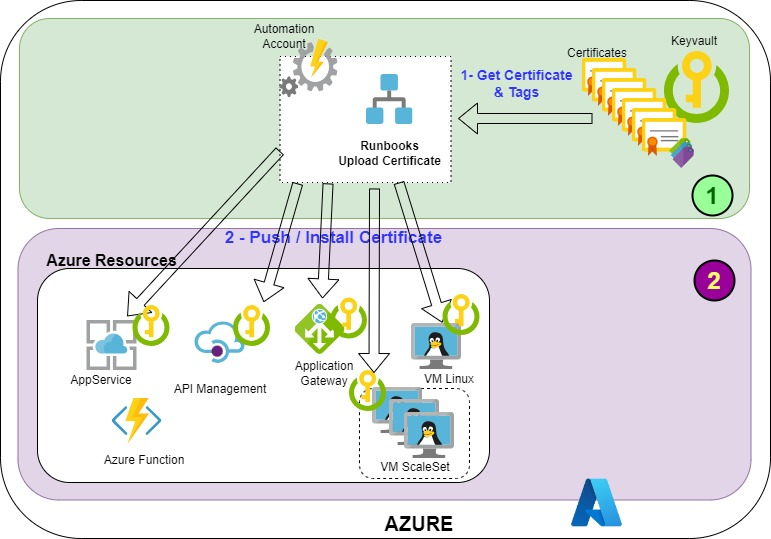
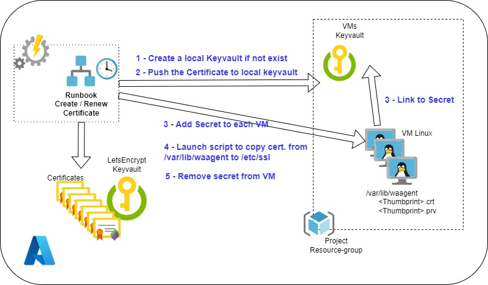

[comment]: <> (
  Le code entre les balise '<!--' et '-->' est à conserver :
  Il permet de créer une table des matières lors de la génération du docx via le script gendoc.sh
)

<!--
```{=openxml}
<w:p>
  <w:r>
    <w:br w:type="page"/>
  </w:r>
</w:p>
<w:sdt>
  <w:sdtPr>
    <w:docPartObj>
      <w:docPartGallery w:val="Sommaire" /><w:docPartUnique />
    </w:docPartObj>
  </w:sdtPr>
  <w:sdtContent>
    <w:p>
      <w:pPr><w:pStyle w:val="En-ttedetabledesmatires" /></w:pPr>
      <w:r><w:t>Table des matières</w:t></w:r>
    </w:p>
    <w:p></w:p>
    <w:p>
      <w:r>
        <w:fldChar w:fldCharType="begin" w:dirty="true" />
        <w:instrText> TOC \o "1-3" \h \z \u</w:instrText><w:fldChar w:fldCharType="separate" />
        <w:fldChar w:fldCharType="end" />
      </w:r>
    </w:p>
  </w:sdtContent>
</w:sdt>
```
-->

# Upload des certificats dans les ressources Azure

## Sommaire
- [Upload des certificats dans les ressources Azure](#upload-des-certificats-dans-les-ressources-azure)
  - [Sommaire](#sommaire)
- [1. Introduction](#1-introduction)
  - [1.1. Référence documentaire](#11-référence-documentaire)
  - [1.2. Objet](#12-objet)
- [2. Architecture et principes](#2-architecture-et-principes)
- [3. Description des Ressources](#3-description-des-ressources)
  - [3.1. Runbook UploadCertToResouces](#31-runbook-uploadcerttoresouces)
    - [3.1.1. Les Paramètres](#311-les-paramètres)
  - [3.2. AppService](#32-appservice)
  - [3.3. Virtual Machine](#33-virtual-machine)
  - [3.4. Virtual Machine Scale Sets](#34-virtual-machine-scale-sets)
  - [3.5. Application Gateway](#35-application-gateway)
  - [3.6. API Management](#36-api-management)
- [4. Les POC](#4-les-poc)
  - [4.1. POC AppService](#41-poc-appservice)
  - [4.2. POC VMLinux](#42-poc-vmlinux)
- [4. Liens vers le code](#4-liens-vers-le-code)
  

# 1. Introduction

## 1.1. Référence documentaire

| Ref.                                  | Description    |
| :-----------------------              | :----------------------- |
| [Gestion des certificats Let's Encrypt](https://github.com/ppaven/prj-certif-doc/blob/master/Certificates-Mngt.md)   | Gestion des certificats LetEncrypt dans Azure |


## 1.2. Objet

Ce document présente la seconde partie du système de gestions automatisées des certificats letsencrypt.  
Il décrit le système d'installation des Certificats Let's Encrypt dans les ressources Azure, et présente les POC de validation : POC AppService et POC VMLinux.  

# 2. Architecture et principes 
 

# 3. Description des Ressources 

Plusieurs types de ressources sont concernées : 
  - AppService (WebApp)
  - Application Gateway
  - API Management
  - VM et VM Scaleset (Linux)

Dans la plupart des cas, le certificat généré puis stocké dans le Keyvault centralisé est copié dans un Keyvault local, et les ressources se réfèrent à ce certificat dans le keyvault local.

## 3.1. Runbook UploadCertToResouces
Ce Runbook permet d'installer un certificat LetsEncrypt, stocké dans le Keyvault centralisé, dans une des ressources Azure précédemment cité.  
Il est appellé par le Runbook 'Create-LetsEncrypt' et 'Renew-LetsEncrypt'.

### 3.1.1. Les Paramètres
| Position | Paramètre    | Description    |
| :--------| :---------- | :---------- | 
| 1 | CertificateName | Nom du certificat à uploader |
| 2 | DomainName | Nom du domaine  |
| 3 | SubscriptionNameAll  | Liste des souscriptions des ressources |  |
| 4 | ResourceGroupAll  | Liste des resource-group des ressources |
| 5 | ResourceTypeAll  |  Liste des types de ressource (AppService, VM, VMSS, API, AGW) |
| 6 | ResourcesAll  |  Liste des ressopurces |
| 7 | (EndPoint_ListenerAll)  | Liste des EndPoint : ("Portal" ou "Proxy") ou NomListener | |
| 8 | (KeyVaultAll)  |  Liste des Keyvault locaux |

( ) : Paramètre optionnel

## 3.2. AppService
L'upload du certificat sur les AppService se fait, soit : 
  - En utilisant la cmdlet `New-AzWebAppSSLBinding` pour charger le fichier certificat précédemment exporter du Keyvault centralisé. sous forme de fichier
  - En utilisant la cmdlet `Import-AzWebAppKeyVaultCertificate` pour importer le certificat depuis un Keyvault local (certificat précédemment copié depuis le Keyvault centralisé).

## 3.3. Virtual Machine  
L'upload du certificat sur les VM se fait via la cmdlet `Add-AzVMSecret` qui permet de récupérer un certificat stocké dans un keyvault et le copie dans le répertoire `/var/lib/waagent`

Ce mécanisme nous impose d'avoir un keyvault local, il sera créé automatiquement si il n'est pas spécifié dans l'appel au module de création du certificat. 

 

## 3.4. Virtual Machine Scale Sets 
Les VM Scale Sets sont des Instances qui font partie d'un "Scale Sets" (Ajout ou suppression automatique de VM en fonction de règles de scaling)
Dans ce cas le paramètre "Resources" à indiquer à la création du certificat est le nom du Scale Sets et pas les noms des instances.

## 3.5. Application Gateway
Pour l'installation d'un certificat dans une Application Gateway, le nom du Listener (paramètre EndPoint_Listener) est nécessaire cf. [§3.1.1.](#311-les-paramètres)

Il n'est pas possible de créer une Application Gateway sans avoir de certificat, cette contrainte nous impose d'avoir
le séquencement de création suivant :
  1. Création d'un Keyvault Local
  2. Création d'un certificat autosigné dans le Keyvault Local
  3. Création de l'App-Gateway avec utilisation du certificat autosigné
  4. Appel au module "create-certif" pour créer le certificat Let's Encrypt et le copier dans le keyvault local, puis mis à jour de l'Application Gateway
  5. Lors du renouvellement, le Runbook mets à jour à la fois le keyvault local et l'App Gateway.

## 3.6. API Management
Pour l'API-Management, nous gardons le même principe de mise à jour des certificats par l'intermédiaire d'un autre keyvault propre au projet.

# 4. Les POC
Pour tester les différents modules de gestions des certificats dans Azure, il a été créé des mini projets (POC) dont la structure des répertoires est la suivante : 
```
.
├── doc
│         
├── modules
│   ├── certif-mgmt-infra
│   │   ├── README.md
│   │   ├── automation_account.tf
│   │   ├── keyvault.tf
│   │   ├── main.tf
│   │   ├── runbooks
│   │   │   ├── CreateCert-LetsEncrypt.tpl.ps1
│   │   │   └── Renew-LetsEncrypt.tpl.ps1
│   │   ├── runbooks.tf
│   │   ├── sa.tf
│   │   └── vars.tf
│   ├── create-certif
│   │   ├── README.md
│   │   ├── create_certif.tf
│   │   ├── main.tf
│   │   ├── outputs.tf
│   │   └── vars.tf
│   ├── tags
│   │   ├── README.md
│   │   ├── outputs.tf
│   │   └── vars.tf
│   ├── upload-certif
│   │   ├── README.md
│   │   ├── main.tf
│   │   ├── upload_certif.tf
│   │   └── vars.tf
│   └── uploadcert-infra
│       ├── README.md
│       ├── automation_account.tf
│       ├── keyvault.tf
│       ├── main.tf
│       ├── runbooks
│       │   └── UploadCertToResources.tpl.ps1
│       ├── runbooks.tf
│       ├── scripts
│       │   └── update_cert.sh
│       └── vars.tf
├── poc
    ├── 1-appservice
    │   ├── README.md
    │   ├── app_service.tf
    │   ├── app_service_plan.tf
    │   ├── cert_infra.tf
    │   ├── create_certif_appservice.tf
    │   ├── dns.tf
    │   ├── main.tf
    │   ├── scripts
    │   │   └── export_ovh_dns.py
    │   ├── tags.tf
    │   ├── terraform.tf
    │   ├── terraform.tfvars
    │   ├── uploadcert_infra.tf
    │   └── vars.tf
    └── 2-vmlinux
        ├── README.md
        ├── avm_kv.tf
        ├── avm_nsg.tf
        ├── avm_vm.tf
        ├── create_certif_webvm.tf
        ├── dns.tf
        ├── main.tf
        ├── tags.tf
        ├── terraform.tf
        ├── terraform.tfvars
        ├── upload_certif_webvm.tf
        ├── vars.tf
        └── vnet.tf

```

## 4.1. POC AppService 

## 4.2. POC VMLinux 

# 4. Liens vers le code
- [modules/certif-mgmt-infra](https://github.com/ppaven/prj-certif-modules-certif-mgmt-infra) : Module de création de l'infra de gestion des certificats
- [modules/create-certif](https://github.com/ppaven/prj-certif-modules-create-certif) : Module d'appel au Runbook de création d'un certificat (via WebHook)
- [modules/uploadcert-infra](https://github.com/ppaven/prj-certif-modules-uploadcert-infra) : Module de création du Runbook d'Upload des certificats dans les ressources
- [modules/upload-certif](https://github.com/ppaven/prj-certif-modules-upload-certif) : Module d'appel au Runbook d'Upload des certificats
- [modules/tags](https://github.com/ppaven/prj-certif-modules-tags) : Module de création des tags
- [poc/AppService](https://github.com/ppaven/prj-certif-poc-appservice): 
  - Appel aux modules pour la création de l'infra
  - Création d'un AppService de test
  - Appel aux modules de création du certificats + Upload dans l'AppService
- [poc/VMLinux](https://github.com/ppaven/prj-certif-poc-vmlinux): 
  - Utilisation des `Azure Verified Modules` pour la création 
    - d'une VM
    - d'un keyvault local
    - d'un NSG
  - Appel aux modules de création du certificats + Upload dans l'AppService
