[comment]: <> (
  Le code entre les balise '<!--' et '-->' est à conserver :
  Il permet de créer une table des matières lors de la génération du docx via le script gendoc.sh
)

<!--
```{=openxml}
<w:p>
  <w:r>
    <w:br w:type="page"/>
  </w:r>
</w:p>
<w:sdt>
  <w:sdtPr>
    <w:docPartObj>
      <w:docPartGallery w:val="Sommaire" /><w:docPartUnique />
    </w:docPartObj>
  </w:sdtPr>
  <w:sdtContent>
    <w:p>
      <w:pPr><w:pStyle w:val="En-ttedetabledesmatires" /></w:pPr>
      <w:r><w:t>Table des matières</w:t></w:r>
    </w:p>
    <w:p></w:p>
    <w:p>
      <w:r>
        <w:fldChar w:fldCharType="begin" w:dirty="true" />
        <w:instrText> TOC \o "1-3" \h \z \u</w:instrText><w:fldChar w:fldCharType="separate" />
        <w:fldChar w:fldCharType="end" />
      </w:r>
    </w:p>
  </w:sdtContent>
</w:sdt>
```
-->

# Délégation d'une zone DNS externe vers Azure DNS

## Sommaire
- [Délégation d'une zone DNS externe vers Azure DNS](#délégation-dune-zone-dns-externe-vers-azure-dns)
  - [Sommaire](#sommaire)
- [1. Introduction](#1-introduction)
  - [1.1. Référence documentaire](#11-référence-documentaire)
  - [1.2. Objet](#12-objet)
- [2. Création de la Zone DNS Azure](#2-création-de-la-zone-dns-azure)
  - [2.1. Résultat après création](#21-résultat-après-création)
- [3. Déléguation de la zone DNS à Azure](#3-déléguation-de-la-zone-dns-à-azure)
  - [3.1. Vérification](#31-vérification)
- [4. Récupération des enregistrements DNS](#4-récupération-des-enregistrements-dns)
  - [4.1. Export des enregistrements DNS OVHcloud](#41-export-des-enregistrements-dns-ovhcloud)
    - [4.1.1. Création d'un token d'authentification](#411-création-dun-token-dauthentification)
    - [4.1.2. Création et exécution du script d'export](#412-création-et-exécution-du-script-dexport)
  - [4.2. Import des enregistrements DNS](#42-import-des-enregistrements-dns)
- [5. Conclusion](#5-conclusion)
  

# 1. Introduction

## 1.1. Référence documentaire

| Ref.                                  | Description    |
| :-----------------------              | :----------------------- |
| [Gestion des certificats](https://github.com/ppaven/prj-certif-doc/blob/master/Certificates-Mngt.md)   | Description du système de gestion des certificat dans Azure |


## 1.2. Objet

Dans le cadre de la gestion des certificats publics dans Azure (Création, renouvellement), nous utilisons la vérification Let's Encrypt en utilisant les zones DNS.  
Cela implique de créer une zone DNS public dans Azure et d'opérer à une délégation de la zone en question à partir du fournisseur du domaine.

# 2. Création de la Zone DNS Azure 

Utilisation de Terraform - le code ci-dessous : 
```
resource "azurerm_dns_zone" "pub_zone" {
  name                = var.zone_name
  resource_group_name = azurerm_resource_group.rg.name

  tags = module.tags.datamap
}
```
## 2.1. Résultat après création

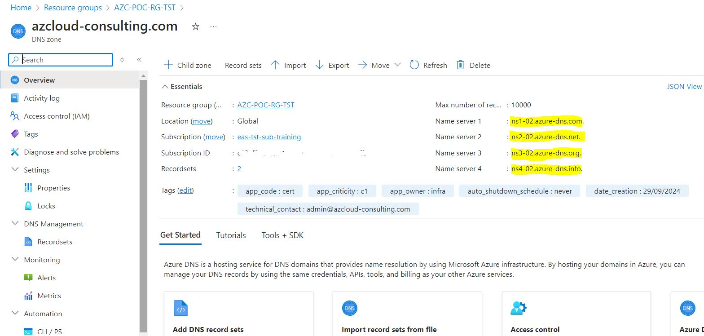

# 3. Déléguation de la zone DNS à Azure

Pour la POC "Gestion des certificats", le domaine utilisé est “azcloud-consulting.com”, dont le fournisseur de nom de domaine est OVHcloud. Cette procédure peut varier selon les fournisseurs de nom de domaine, mais la logique reste la même.

Depuis le dashboard OVHcloud : https://www.ovh.com/manager/#/web/domain/\<Nom de domaine>/information  
  
Aller dans la section "**Serveurs DNS**"  
Par défaut, ce sont les serveurs DNS d’OVHcloud qui sont utilisés pour gérer la zone DNS :
- dns19.ovh.net
- ns19.ovh.net  
  
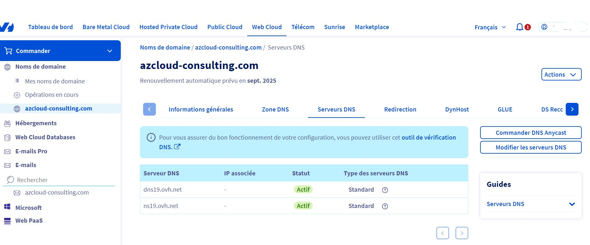

Dans la partie gauche de la page, sélectionner "**Modifier les serveurs DNS**", ajouter les serveurs DNS Azure : 
- ns1-02.azure-dns.com
- ns2-02.azure-dns.net
- ns3-02.azure-dns.org
- ns4-02.azure-dns.info 
   
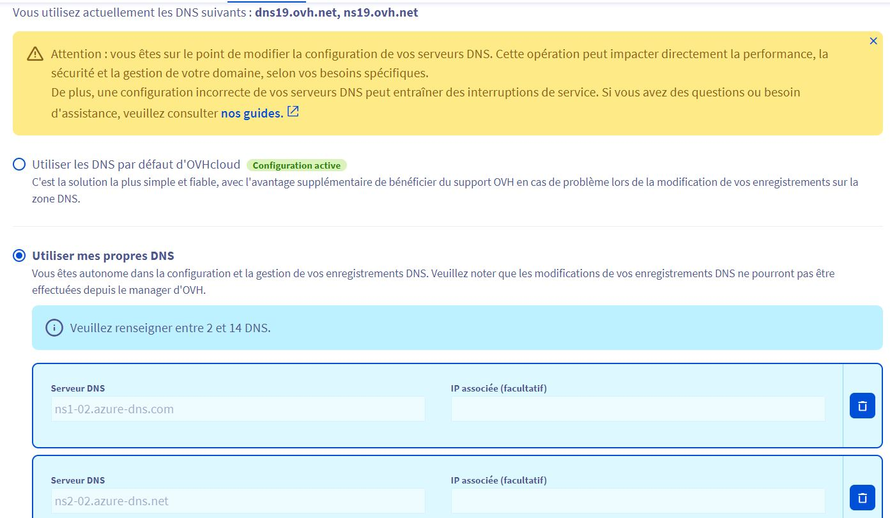

Confirmer les modifications et l'état deviendra le suivant :  
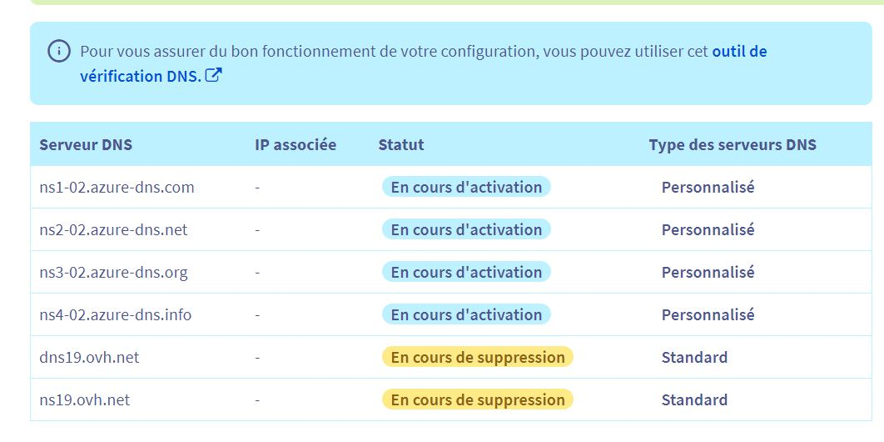

Après plusieurs heures d’attentes, les serveurs OVHcloud ont été remplacés par ceux de Microsoft.
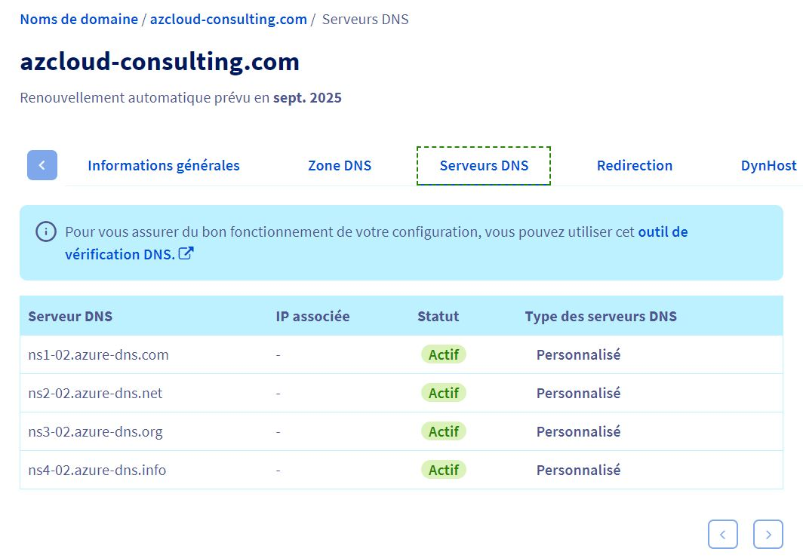

## 3.1. Vérification
Commandes à passer pour vérifier les changements : 
```
nslookup
set type=NS
azcloud-consulting.com
set type=SOA
azcloud-consulting.com
```

Résultat : 
```
C:\Users>nslookup

> set type=NS
> azcloud-consulting.com
Serveur :   UnKnown
Address:  192.168.1.254

Réponse ne faisant pas autorité :
azcloud-consulting.com  nameserver = ns3-02.azure-dns.org
azcloud-consulting.com  nameserver = ns4-02.azure-dns.info
azcloud-consulting.com  nameserver = ns1-02.azure-dns.com
azcloud-consulting.com  nameserver = ns2-02.azure-dns.net
> set type=SOA
> azcloud-consulting.com

Réponse ne faisant pas autorité :
azcloud-consulting.com
        primary name server = ns1-02.azure-dns.com
        responsible mail addr = azuredns-hostmaster.microsoft.com
        serial  = 1
        refresh = 3600 (1 hour)
        retry   = 300 (5 mins)
        expire  = 2419200 (28 days)
        default TTL = 300 (5 mins)
```

# 4. Récupération des enregistrements DNS

Les intérrogations DNS arrivant dorénavant sur la zone DNS déclarée dans Azure, il est nécessaire de réintégrer les enregistrements DNS précédemment existantes dans la zone DNS du fournisseur d'origine. 

Coté Azure, il est possible d'importer un fichier texte contenant ces enregistrements DNS, mais coté OVHcloud il n'y a pas de menu d'exportation dans l'interface d'administration.  
Cette exportation ce fera donc par appel API.

## 4.1. Export des enregistrements DNS OVHcloud
L'appel API nécessite la création d'un token d'authentification

### 4.1.1. Création d'un token d'authentification
Cela se fait en allant sur cette page : https://www.ovh.com/auth/api/createToken

Demande d'authentification :  
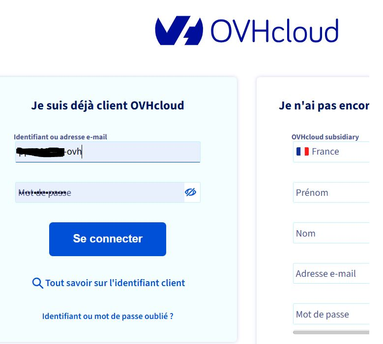

Configuration du token :  
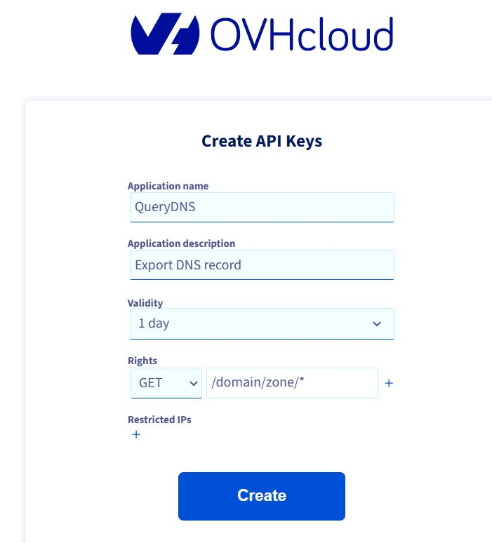

Résultat, récupérer les identifants affichés : 
- Application Key
- Application secret
- Consumer Key  

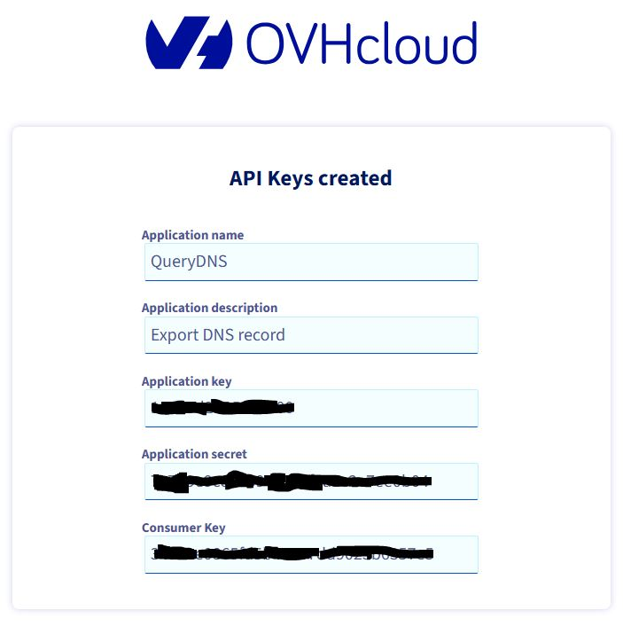

### 4.1.2. Création et exécution du script d'export

Le script est codé en python et récupère les identifiants du token via des variables d'environnement du système sous-jacent :  

```
'''
First, install the latest release of Python wrapper: $ pip install ovh
'''
import json
import ovh
import os
appkey = os.environ["OVH_APP_KEY"]
appsecret = os.environ["OVH_APP_SECRET"]
conskey = os.environ["OVH_APP_CONSK"]
zoneName= os.environ["OVH_ZONE"]

# Instantiate an OVH Client.
# You can generate new credentials with full access to your account on
# the token creation page (https://api.ovh.com/createToken/index.cgi?GET=/*&PUT=/*&POST=/*&DELETE=/*)
client = ovh.Client(
    endpoint            ='ovh-eu',              # Endpoint of API OVH (List of available endpoints: https://github.com/ovh/python-ovh#2-configure-your-application)
    application_key     =appkey,               # Application Key
    application_secret  =appsecret,            # Application Secret
    consumer_key        =conskey,              # Consumer Key
)

result = client.get("/domain/zone/"+zoneName+"/export")

#  Print and export
print("Création du fichier d'export : "+zoneName+".txt ...")

with open(zoneName+'.txt', 'w') as f:
    print(result, file=f)

print("... Done.")

```  
 
Exécution du script :   

```  
$ python3 export_ovh_dns.py
Création du fichier d'export : azcloud-consulting.com.txt ...
... Done.
```

## 4.2. Import des enregistrements DNS
L'import des enregistrements DNS dans la zone créé dans Azure peut se faire via l'interface Azure.
Aller sur la Zone, cliquer sur "Import", charger le fichier généré :  


Cliquer sur "Review Create" :   
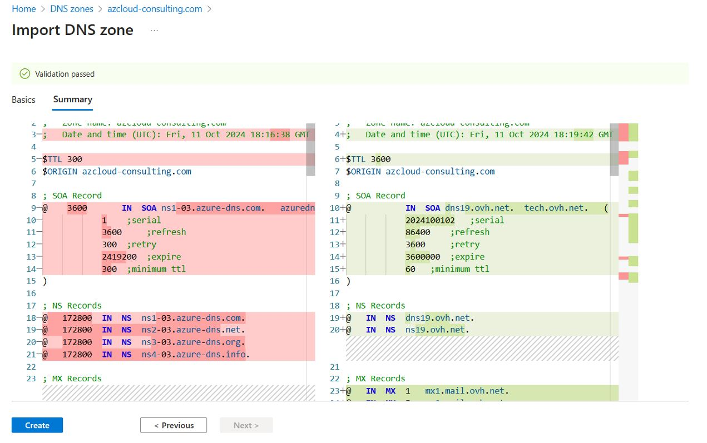

Aller à l'onglet "Basics"  et  supprimer les records : 
  - SOA
  - NS 
  - TTL  
  
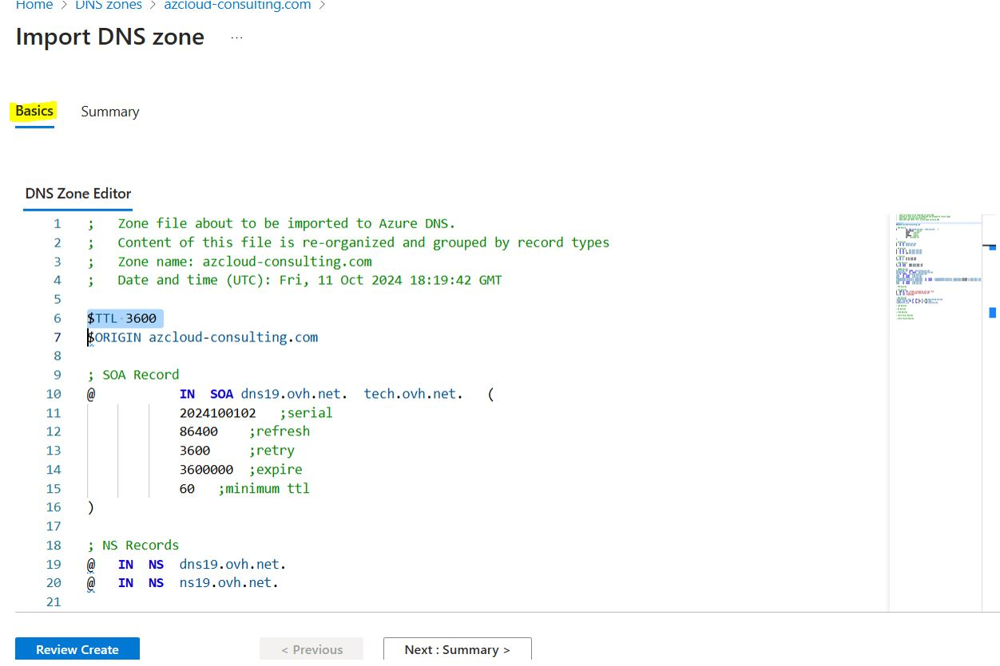

Cliquer sur "Review Create" :  
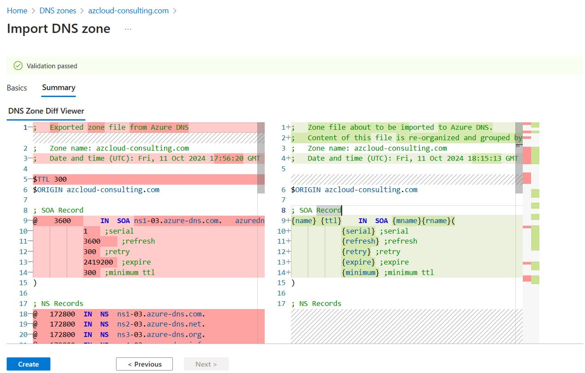

Vérifier et cliquer sur "Create" :  


# 5. Conclusion

Déléguer la gestion des enregistrements DNS à la solution Azure DNS présente plusieurs avantages : 
- La création des enregistrements et leurs mises à jour sont instantanées au sein d'Azure.
- Pour les entreprises qui ont leurs environnements hébergés sur Azure et qui utilisent l’IaaC (Terraform ou autre language), les créations de zones et d'enregistrements DNS deviennent très facile à industrialiser.

