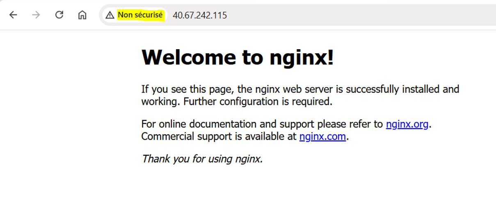
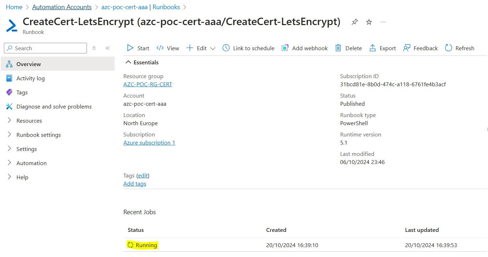
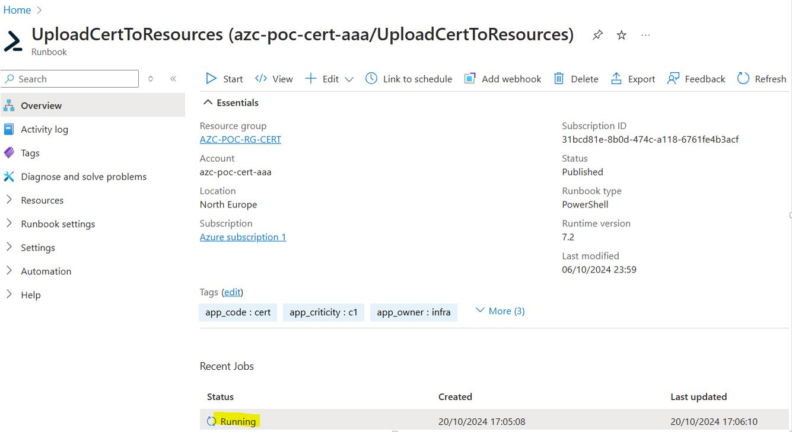
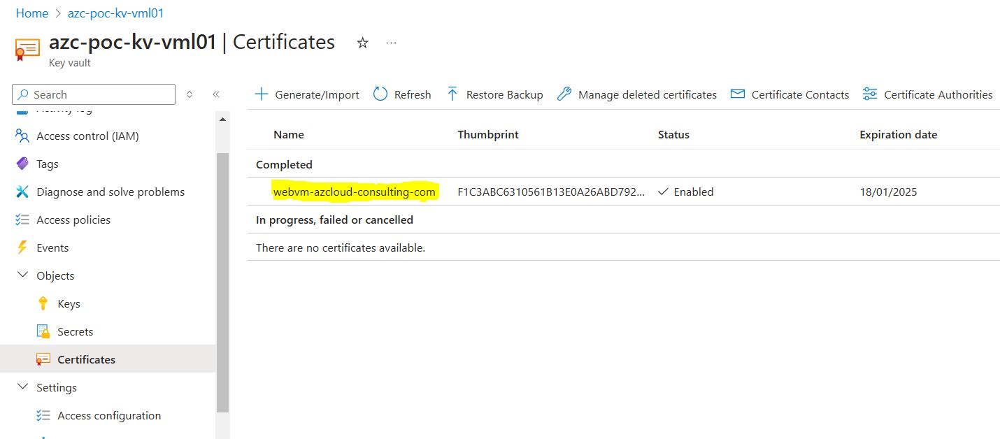
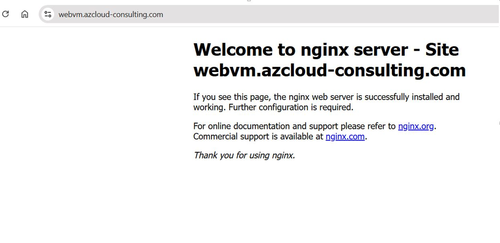

[comment]: <> (
  Le code entre les balise '<!--' et '-->' est à conserver :
  Il permet de créer une table des matières lors de la génération du docx via le script gendoc.sh
)

<!--
```{=openxml}
<w:p>
  <w:r>
    <w:br w:type="page"/>
  </w:r>
</w:p>
<w:sdt>
  <w:sdtPr>
    <w:docPartObj>
      <w:docPartGallery w:val="Sommaire" /><w:docPartUnique />
    </w:docPartObj>
  </w:sdtPr>
  <w:sdtContent>
    <w:p>
      <w:pPr><w:pStyle w:val="En-ttedetabledesmatires" /></w:pPr>
      <w:r><w:t>Table des matières</w:t></w:r>
    </w:p>
    <w:p></w:p>
    <w:p>
      <w:r>
        <w:fldChar w:fldCharType="begin" w:dirty="true" />
        <w:instrText> TOC \o "1-3" \h \z \u</w:instrText><w:fldChar w:fldCharType="separate" />
        <w:fldChar w:fldCharType="end" />
      </w:r>
    </w:p>
  </w:sdtContent>
</w:sdt>
```
-->

# POC AppService

## Sommaire
- [POC AppService](#poc-appservice)
  - [Sommaire](#sommaire)
- [1. Introduction](#1-introduction)
  - [1.1. Référence documentaire](#11-référence-documentaire)
  - [1.2. Objet](#12-objet)
- [3. Build : Utilisation des Azure Verified Modules](#3-build--utilisation-des-azure-verified-modules)
  - [3.1. Installation du serveur WEB (nginx)](#31-installation-du-serveur-web-nginx)
  - [3.2. Configuration du serveur WEB (nginx)](#32-configuration-du-serveur-web-nginx)
- [4. Création et upload du certificat](#4-création-et-upload-du-certificat)
- [5. Vérification du site web](#5-vérification-du-site-web)
- [6. Liens vers le code](#6-liens-vers-le-code)
  

# 1. Introduction

## 1.1. Référence documentaire

| Ref.                                  | Description    |
| :-----------------------              | :----------------------- |
| [Gestion des certificats Let's Encrypt](https://github.com/ppaven/prj-certif-doc/blob/master/Certificates-Mngt.md)   | Gestion des certificats Let's Encrypt dans Azure |
| [Upload des certificats](https://github.com/ppaven/prj-certif-doc/blob/master/Certificates-Upload.md)   | Chargement des certificats dans les ressources Azure |


## 1.2. Objet

Ce document présente le mini projet (POC) réalisé pour valider, pour la partie AppService, le système de gestion des certificats Let's Encrypt.

# 3. Build : Utilisation des [Azure Verified Modules](https://azure.github.io/Azure-Verified-Modules/) 

Les [Azure Verified Modules](https://azure.github.io/Azure-Verified-Modules/) ont été utilisés pour créer les ressources suivantes : 
- La VM
- Le Keyvault local
- Le NSG

Le code terraform est ici :  [poc/VMLinux](https://github.com/ppaven/prj-certif-poc-vmlinux)

Dans la plupart des cas, le certificat généré puis stocké dans le Keyvault centralisé est copié dans un Keyvault local, et les ressources se référencent à ce certificat dans le keyvault local. 

## 3.1. Installation du serveur WEB (nginx)
```
# apt install nginx
```
Le serveur est configuré par défaut en http, 
Test : http://40.67.242.115


"non sécurisé", c'est normal on est en "http" sans le "s" de sécurisé.

## 3.2. Configuration du serveur WEB (nginx)
```
vi /etc/nginx/sites-available/webvm
```
```

    server {
      listen 80;
      server_name webvm.azcloud-consulting.com;
    
      # Redirect all traffic to SSL
      rewrite ^ https://$host$request_uri? permanent;
    }
    
    server {
      listen 443 ssl ;
    
      # disables all weak ciphers
      ssl_ciphers ALL:!aNULL:!ADH:!eNULL:!LOW:!EXP:RC4+RSA:+HIGH:+MEDIUM;
    
      server_name webvm.azcloud-consulting.com;
    
      ## Access and error logs.
      access_log /var/log/nginx/access.log;
      error_log  /var/log/nginx/error.log info;
    
      ## Keep alive timeout set to a greater value for SSL/TLS.
      keepalive_timeout 75 75;
    
      ## See the keepalive_timeout directive in nginx.conf.
      ## Server certificate and key.
      ssl_certificate /etc/ssl/certs/webvm.azcloud-consulting.com.crt;
      ssl_certificate_key /etc/ssl/private/webvm.azcloud-consulting.com.key;
      ssl_session_timeout  5m;
    
      ## Strict Transport Security header for enhanced security. See
      ## http://www.chromium.org/sts. I've set it to 2 hours; set it to
      ## whichever age you want.
      add_header Strict-Transport-Security "max-age=7200";
    
      location / {
        root /var/www/webvm;
        index index.html index.htm;
      }
    }
  
```
```
cd /etc/nginx/sites-enabled
 rm default; ln -s /etc/nginx/sites-available/webvm
 systemctl reload nginx
```

# 4. Création et upload du certificat 
Code terraform : 
```
module "cert_vm" {
  source = "../../modules/create-certif/"

  aaa_subs_id        = var.subscription_id
  aaa_rgp            = "AZC-POC-RG-CERT"
  aaa_name           = "azc-poc-cert-aaa"
  domain_names       = "webvm.${var.zone_name}"
  dns_subscription   = data.azurerm_subscription.subs.display_name
  dns_resource_group = local.dns_rg_name
  dns_zone           = var.zone_name
  subscription       = data.azurerm_subscription.subs.display_name
  resource_group     = azurerm_resource_group.rg.name
  resource_type      = "VM"
  resources          = module.vm.name
  keyvault           = lower("${module.naming.key_vault.name}01")
}
```
```
terraform init
terraform apply
```

Suivi sur le portail Azure de l'exécution du Runbook :  


Puis enchaînement avec le Runbook `UploadCertToRessources` :  


Logs du Runbook `UploadCertToRessources` : 

```
Logging in to Azure...


Environments                                                                                           Context
------------                                                                                           -------
{[AzureUSGovernment, AzureUSGovernment], [AzureCloud, AzureCloud], [AzureChinaCloud, AzureChinaCloud]} Microsoft.Azure.…

VM : download update_cert.sh script ...

  Import certificate  into keyvault ...

VM : Upload Cert in /var/lib/waagent

  Add Secret to VM azc-poc-vm-vml01 ...


RequestId IsSuccessStatusCode StatusCode ReasonPhrase
--------- ------------------- ---------- ------------
                         True         OK 

  Run update_cert.sh script ...


Value     : {Microsoft.Azure.Management.Compute.Models.InstanceViewStatus}
Name      : 
StartTime : 
EndTime   : 
Status    : Succeeded
Error     : 
Output    : 
Capacity  : 0
Count     : 0
Item      : 

  Remove secret from VM ...


RequestId IsSuccessStatusCode StatusCode ReasonPhrase
--------- ------------------- ---------- ------------
                         True         OK 
```

Vérification du certificat dans le Keyvault local :  


# 5. Vérification du site web
https://webvm.azcloud-consulting.com  


# 6. Liens vers le code
- [modules/certif-mgmt-infra](https://github.com/ppaven/prj-certif-modules-certif-mgmt-infra) : Module de création de l'infra de gestion des certificats
- [modules/create-certif](https://github.com/ppaven/prj-certif-modules-create-certif) : Module d'appel au Runbook de création d'un certificat (via WebHook)
- [modules/uploadcert-infra](https://github.com/ppaven/prj-certif-modules-uploadcert-infra) : Module de création du Runbook d'Upload des certificats dans les ressources
- [modules/upload-certif](https://github.com/ppaven/prj-certif-modules-upload-certif) : Module d'appel au Runbook d'Upload des certificats
- [modules/tags](https://github.com/ppaven/prj-certif-modules-tags) : Module de création des tags
- [poc/VMLinux](https://github.com/ppaven/prj-certif-poc-vmlinux): 
  - Utilisation des [Azure Verified Modules](https://azure.github.io/Azure-Verified-Modules/) pour la création 
    - d'une VM
    - d'un keyvault local
    - d'un NSG
  - Appel aux modules de création du certificats + Upload dans l'AppService
