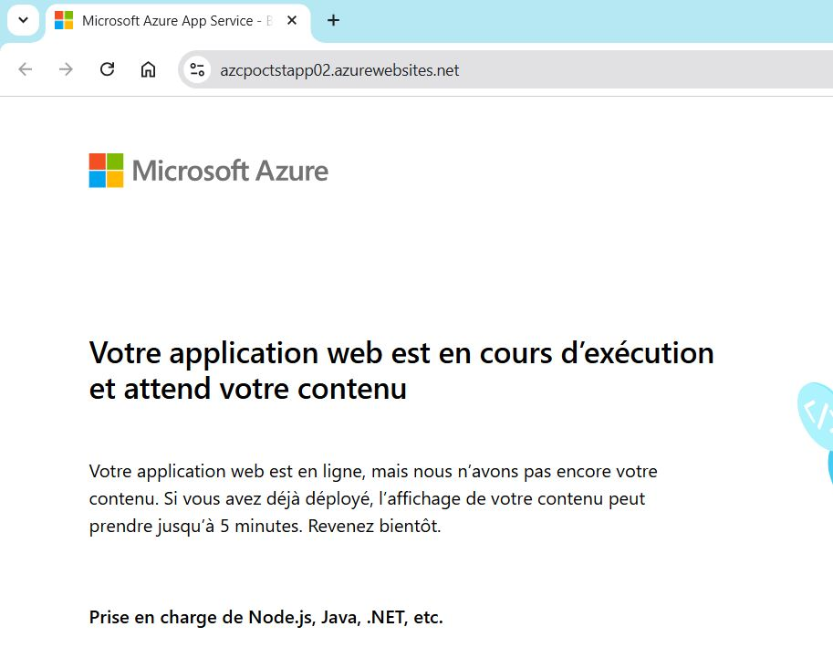
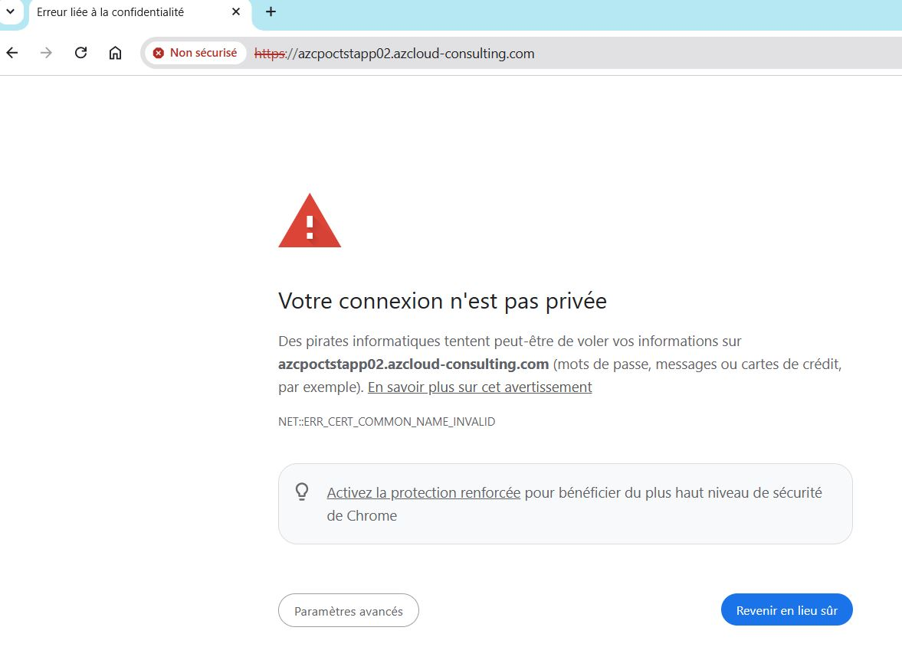
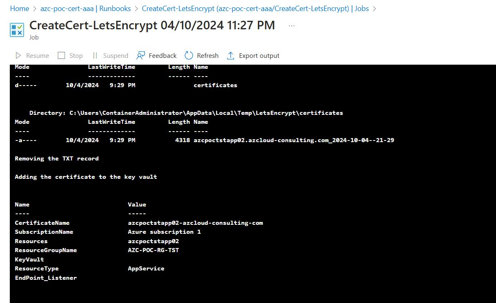
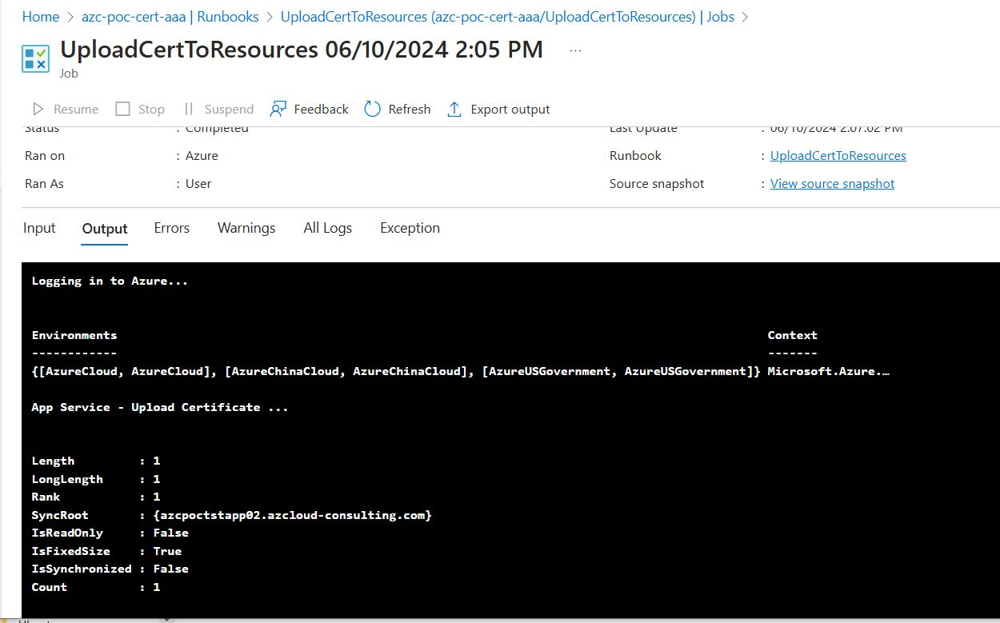
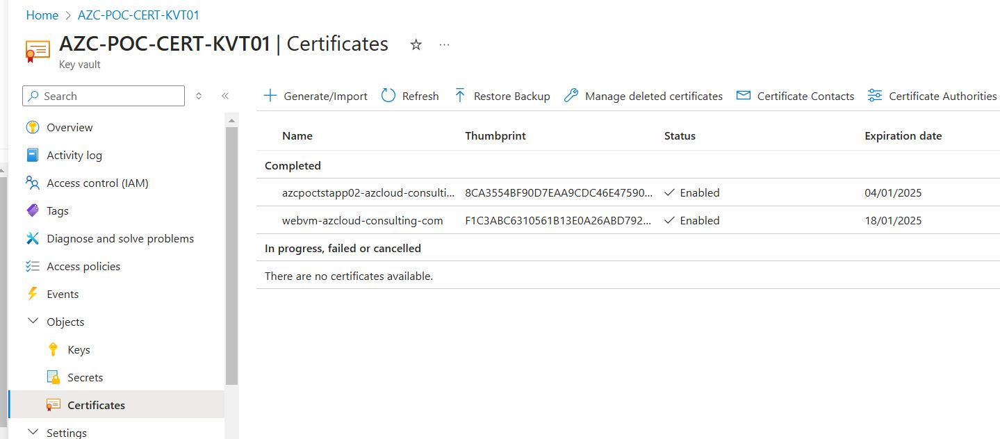
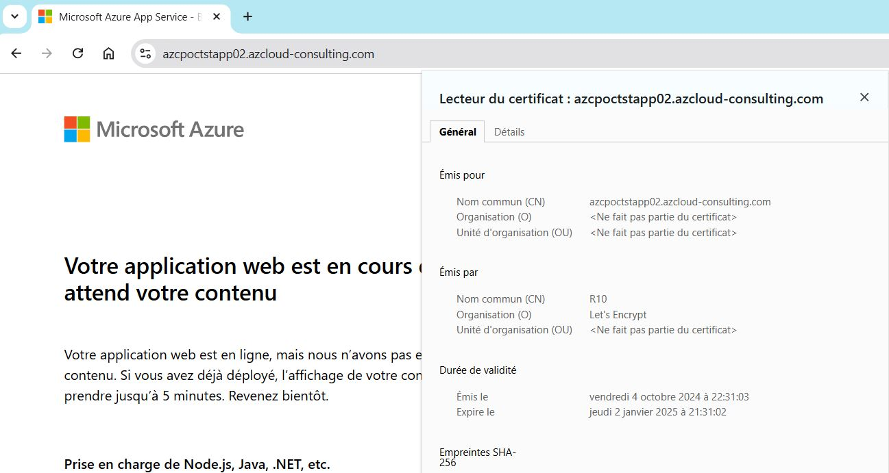

[comment]: <> (
  Le code entre les balise '<!--' et '-->' est à conserver :
  Il permet de créer une table des matières lors de la génération du docx via le script gendoc.sh
)

<!--
```{=openxml}
<w:p>
  <w:r>
    <w:br w:type="page"/>
  </w:r>
</w:p>
<w:sdt>
  <w:sdtPr>
    <w:docPartObj>
      <w:docPartGallery w:val="Sommaire" /><w:docPartUnique />
    </w:docPartObj>
  </w:sdtPr>
  <w:sdtContent>
    <w:p>
      <w:pPr><w:pStyle w:val="En-ttedetabledesmatires" /></w:pPr>
      <w:r><w:t>Table des matières</w:t></w:r>
    </w:p>
    <w:p></w:p>
    <w:p>
      <w:r>
        <w:fldChar w:fldCharType="begin" w:dirty="true" />
        <w:instrText> TOC \o "1-3" \h \z \u</w:instrText><w:fldChar w:fldCharType="separate" />
        <w:fldChar w:fldCharType="end" />
      </w:r>
    </w:p>
  </w:sdtContent>
</w:sdt>
```
-->

# POC AppService

## Sommaire
- [POC AppService](#poc-appservice)
  - [Sommaire](#sommaire)
- [1. Introduction](#1-introduction)
  - [1.1. Référence documentaire](#11-référence-documentaire)
  - [1.2. Objet](#12-objet)
- [2. Build](#2-build)
  - [2.1. Installation du serveur WEB](#21-installation-du-serveur-web)
- [3. Création et upload du certificat](#3-création-et-upload-du-certificat)
- [5. Vérification du site web](#5-vérification-du-site-web)
- [6. Liens vers le code](#6-liens-vers-le-code)
  

# 1. Introduction

## 1.1. Référence documentaire

| Ref.                                  | Description    |
| :-----------------------              | :----------------------- |
| [Gestion des certificats Let's Encrypt](https://github.com/ppaven/prj-certif-doc/blob/master/Certificates-Mngt.md)   | Gestion des certificats Let's Encrypt dans Azure |
| [Upload des certificats](https://github.com/ppaven/prj-certif-doc/blob/master/Certificates-Upload.md)   | Chargement des certificats dans les ressources Azure |


## 1.2. Objet

Ce document présente le mini projet (POC) réalisé pour valider, pour la partie AppService, le système de gestion des certificats Let's Encrypt.

# 2. Build

Le code terraform est ici :  [poc/AppService](https://github.com/ppaven/prj-certif-poc-appservice)

Dans l'AppService (WebApp), Il a été déployé le code suivant https://github.com/Azure-Samples/nodejs-docs-hello-world permettant d'avoir un mini site web pour faire nos tests.

## 2.1. Installation du serveur WEB

Dans la plupart des cas, le certificat généré puis stocké dans le Keyvault centralisé est copié dans un Keyvault local, et les ressources se référencent à ce certificat dans le keyvault local. 

Ce site web répond correctement en http : 


Mais affiche logiquement une erreur en HTTPS, car il n'a pas de certificat : 


# 3. Création et upload du certificat 
Code terraform : 
```
module "certificate" {
  source = "../../modules/create-certif/"

  aaa_subs_id        = var.subscription_id
  aaa_rgp            = "AZC-POC-RG-CERT"
  aaa_name           = "azc-poc-cert-aaa"
  domain_names       = "${azurerm_linux_web_app.webapp.name}.${var.zone_name}"
  dns_subscription   = data.azurerm_subscription.subs.display_name
  dns_resource_group = local.dns_rg_name
  dns_zone           = var.zone_name
  subscription       = data.azurerm_subscription.subs.display_name
  resource_group     = local.resource_group_name
  resource_type      = "AppService"
  resources          = local.appservice_name
}
```
```
terraform init
terraform apply
```

Suivi sur le portail Azure de l'exécution du Runbook :  


Puis enchaînement avec le Runbook `UploadCertToRessources` :  


Vérification du certificat dans le Keyvault local :  


# 5. Vérification du site web
https://azcpoctstapp02.azcloud-consulting.com  


# 6. Liens vers le code
- [modules/certif-mgmt-infra](https://github.com/ppaven/prj-certif-modules-certif-mgmt-infra) : Module de création de l'infra de gestion des certificats
- [modules/create-certif](https://github.com/ppaven/prj-certif-modules-create-certif) : Module d'appel au Runbook de création d'un certificat (via WebHook)
- [modules/uploadcert-infra](https://github.com/ppaven/prj-certif-modules-uploadcert-infra) : Module de création du Runbook d'Upload des certificats dans les ressources
- [modules/upload-certif](https://github.com/ppaven/prj-certif-modules-upload-certif) : Module d'appel au Runbook d'Upload des certificats
- [modules/tags](https://github.com/ppaven/prj-certif-modules-tags) : Module de création des tags
- [poc/AppService](https://github.com/ppaven/prj-certif-poc-appservice): 
  - Appel aux modules pour la création de l'infra
  - Création d'un AppService de test
  - Appel aux modules de création du certificats + Upload dans l'AppService
